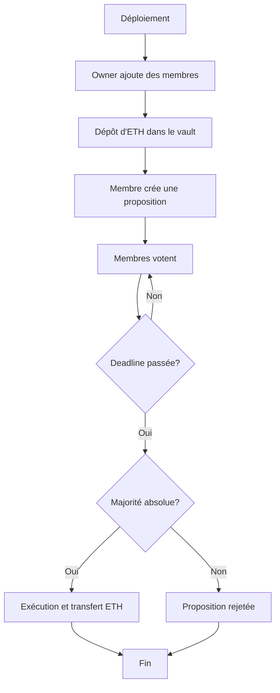

# Rapport de Sécurité - SafeClub

**Projet**: Trésorerie Sécurisée d'un Club Étudiant  
**Version du contrat**: 1.0.0  
**Date**: Décembre 2025  
**Auteurs**: Équipe SafeClub - ING 4 Blockchain

---

## Table des Matières

1. [Description du Contrat](#1-description-du-contrat)
2. [Architecture et Composants](#2-architecture-et-composants)
3. [Modèle de Menaces](#3-modèle-de-menaces)
4. [Vulnérabilités et Contre-mesures](#4-vulnérabilités-et-contre-mesures)
5. [Analyse Statique](#5-analyse-statique)
6. [Recommandations](#6-recommandations)

---

## 1. Description du Contrat

### 1.1 Vue d'ensemble

SafeClub est un smart contract Ethereum développé en Solidity 0.8.x qui permet à un club étudiant de gérer démocratiquement sa trésorerie. Le système repose sur un mécanisme de vote par majorité absolue pour approuver les dépenses.

### 1.2 Objectifs de Sécurité

Les objectifs de sécurité du contrat sont:

1. **Intégrité des fonds**: Les ETH stockés ne peuvent être dépensés que selon les règles établies
2. **Contrôle d'accès**: Seuls les membres autorisés peuvent interagir avec certaines fonctions
3. **Vote démocratique**: Chaque membre ne peut voter qu'une seule fois par proposition
4. **Protection contre les attaques**: Le contrat doit résister aux attaques connues (reentrancy, overflow, etc.)
5. **Transparence**: Toutes les actions importantes sont tracées via des events

### 1.3 Flux de Fonctionnement



---

## 2. Architecture et Composants

### 2.1 Rôles et Permissions

Le contrat définit trois niveaux de permissions:

| Rôle | Permissions | Contrôle |
|------|-------------|----------|
| **Owner** | - Ajouter des membres<br>- Supprimer des membres<br>- Toutes les actions de membre | Modifier `onlyOwner` (Ownable) |
| **Membre** | - Créer des propositions<br>- Voter sur les propositions<br>- Exécuter les propositions approuvées<br>- Consulter les informations | Modifier `onlyMember` |
| **Externe** | - Envoyer des ETH au vault<br>- Consulter les informations publiques | Aucun modifier requis |

### 2.2 Structures de Données

#### Proposal
```solidity
struct Proposal {
    uint256 id;              // ID unique
    string description;      // Description de la dépense
    address payable recipient; // Destinataire des fonds
    uint256 amount;          // Montant en Wei
    uint256 deadline;        // Timestamp de fin des votes
    uint256 votesFor;        // Nombre de votes POUR
    uint256 votesAgainst;    // Nombre de votes CONTRE
    bool executed;           // État d'exécution
    address creator;         // Créateur de la proposition
    uint256 createdAt;       // Timestamp de création
}
```

**Sécurité**: Le champ `executed` empêche la double exécution (protection contre replay).

### 2.3 Variables d'État Critiques

- `mapping(address => bool) public members`: Liste des membres actifs
- `mapping(uint256 => Proposal) public proposals`: Propositions indexées
- `mapping(uint256 => mapping(address => bool)) public hasVoted`: Suivi des votes

**Sécurité**: Utilisation de mappings pour O(1) lookup et gas efficiency.

---

## 3. Modèle de Menaces

Cette section identifie les principales menaces et les scénarios d'attaque potentiels.

### 3.1 Menace #1: Attaque par Reentrancy

#### Description
Un attaquant pourrait tenter d'exploiter la fonction `executeProposal()` en créant un contrat malveillant qui rappelle `executeProposal()` pendant le transfert d'ETH, drainant ainsi les fonds du vault.

#### Scénario d'Attaque

1. L'attaquant crée un contrat malveillant avec une fonction `receive()` ou `fallback()`
2. L'attaquant devient membre et crée une proposition avec son contrat comme destinataire
3. La proposition est votée et acceptée
4. Lors de l'exécution, le contrat reçoit l'ETH et sa fonction `receive()` est déclenchée
5. La fonction `receive()` appelle à nouveau `executeProposal()` avant que `executed` ne soit mis à `true`
6. Le processus se répète, drainant le vault

```solidity
// Contrat Malveillant (EXEMPLE À NE PAS UTILISER)
contract MaliciousContract {
    SafeClub public target;
    uint256 public proposalId;
    
    receive() external payable {
        if (address(target).balance > 0) {
            target.executeProposal(proposalId); // Réentrancy!
        }
    }
}
```

#### Impact
🔴 **CRITIQUE** - Perte totale des fonds du vault

#### Contre-mesures Implémentées

1. **ReentrancyGuard d'OpenZeppelin**: Le modifier `nonReentrant` empêche les appels récursifs

```solidity
function executeProposal(uint256 _proposalId)
    external
    nonReentrant  // ✅ Protection #1
    // ...
```

2. **Pattern Checks-Effects-Interactions**: L'état est modifié AVANT le transfert

```solidity
// EFFECT: Marquer comme exécutée AVANT le transfert
p.executed = true;  // ✅ Protection #2

// INTERACTION: Transférer les fonds
(bool success, ) = p.recipient.call{value: p.amount}("");
```

#### Statut
✅ **MITIGÉ** - Double protection en place

---

### 3.2 Menace #2: Front-Running des Votes

#### Description
Un membre malveillant pourrait observer les transactions de vote dans le mempool et ajuster son vote en fonction des autres votes pour influencer le résultat.

#### Scénario d'Attaque

1. Alice crée une proposition controversée
2. Bob (observateur) attend dans le mempool
3. Bob voit que 2 membres ont voté POUR
4. Bob envoie rapidement un vote CONTRE avec un gas price élevé pour être miné en premier
5. Bob influence le résultat final

#### Impact
🟡 **MOYEN** - Manipulation du vote, mais limité par la règle de majorité absolue

#### Contre-mesures

**Limitations du système blockchain**:
- Ce problème est inhérent aux blockchains publiques
- Impossible à prévenir complètement au niveau du smart contract

**Atténuations possibles** (non implémentées dans v1.0):
- Système de vote par commit-reveal (phase 1: hasher le vote, phase 2: révéler)
- Utilisation d'oracles ou de solutions Layer 2

**Protection actuelle**:
- La **majorité absolue** (> 50% de TOUS les membres) limite l'impact
- Les votes sont publics et traçables (transparence)

#### Statut
🟡 **RISQUE RÉSIDUEL** - Accepté comme limitation du système

---

### 3.3 Menace #3: Déni de Service (DoS)

#### Description
Un attaquant pourrait tenter de bloquer le système en:
- Créant un nombre massif de propositions
- Devenant membre et refusant de voter, bloquant le quorum

#### Scénario d'Attaque A: Spam de Propositions

1. Un membre malveillant crée 1000 propositions
2. L'interface devient inutilisable
3. Le coût en gas pour parcourir les propositions devient prohibitif

#### Impact
🟢 **FAIBLE** - Coût élevé pour l'attaquant (gas fees), impact limité

#### Contre-mesures

**Protection actuelle**:
- Seuls les **membres** peuvent créer des propositions (contrôle d'accès)
- L'owner peut **supprimer** le membre malveillant
- Pas de montant minimum pour créer une proposition, mais **coût en gas** dissuasif

**Limitations**:
- Pas de limite sur le nombre de propositions par membre
- Recommandation future: ajouter un frais de création ou une limite

#### Statut
🟢 **RISQUE FAIBLE** - Contrôle d'accès par l'owner

---

#### Scénario d'Attaque B: Blocage du Vote

1. Un membre refuse délibérément de voter
2. Avec la règle de majorité absolue, certaines propositions ne peuvent jamais atteindre le seuil
3. Les fonds restent bloqués

#### Impact
🟡 **MOYEN** - Peut empêcher certaines propositions de passer

#### Contre-mesures

**Protection actuelle**:
- L'owner peut **supprimer** le membre inactif
- Après suppression, le `memberCount` diminue, facilitant l'atteinte de la majorité
- Les deadlines existent, empêchant les propositions d'être éternelles

**Recommandations**:
- Établir des règles claires de participation
- Possibilité d'implémenter un "quorum minimum" en plus de la majorité

#### Statut
🟡 **RISQUE RÉSIDUEL** - Gestion par gouvernance

---

### 3.4 Menace #4: Manipulation du Vote (Double Vote)

#### Description
Un membre malveillant pourrait tenter de voter plusieurs fois sur la même proposition pour influencer le résultat.

#### Scénario d'Attaque

1. Alice vote POUR la proposition #1
2. Alice tente de voter à nouveau POUR la proposition #1
3. Si réussi, Alice aurait 2 votes au lieu d'1

#### Impact
🔴 **CRITIQUE** - Violation du principe "un membre = un vote"

#### Contre-mesures Implémentées

```solidity
function vote(uint256 _proposalId, bool _support) external {
    // Vérification que le membre n'a pas déjà voté
    if (hasVoted[_proposalId][msg.sender]) revert AlreadyVoted(); // ✅
    
    // Enregistrer le vote
    hasVoted[_proposalId][msg.sender] = true;
    votes[_proposalId][msg.sender] = _support;
    
    // Incrémenter le compteur
    if (_support) {
        proposals[_proposalId].votesFor++;
    } else {
        proposals[_proposalId].votesAgainst++;
    }
}
```

**Protections**:
1. Mapping `hasVoted` pour suivre qui a voté
2. Vérification au début de la fonction `vote()`
3. Custom error `AlreadyVoted()` pour clarté

#### Statut
✅ **MITIGÉ** - Protection complète

---

### 3.5 Menace #5: Exécution Non Autorisée

#### Description
Un attaquant pourrait tenter d'exécuter:
- Une proposition rejetée (pas de majorité)
- Une proposition avant la deadline
- Une proposition déjà exécutée

#### Scénario d'Attaque

1. Une proposition a 1 vote POUR et 3 votes CONTRE (rejetée)
2. L'attaquant appelle `executeProposal()`
3. Si réussi, les fonds seraient transférés malgré le rejet

#### Impact
🔴 **CRITIQUE** - Transfert non autorisé de fonds

#### Contre-mesures Implémentées

```solidity
function executeProposal(uint256 _proposalId)
    external
    onlyMember                           // ✅ Seuls les membres
    proposalExists(_proposalId)          // ✅ Proposition existe
    proposalNotExecuted(_proposalId)     // ✅ Pas déjà exécutée
    nonReentrant
{
    Proposal storage p = proposals[_proposalId];
    
    // ✅ Vérifier que la deadline est passée
    if (block.timestamp <= p.deadline) revert DeadlineNotPassed();
    
    // ✅ Vérifier la majorité absolue
    if (!isProposalAccepted(_proposalId)) revert ProposalNotAccepted();
    
    // ✅ Vérifier les fonds disponibles
    if (p.amount > address(this).balance) revert InsufficientFunds();
    
    // Exécution...
}
```

**6 vérifications** avant exécution:
1. Appelant est membre
2. Proposition existe
3. Pas déjà exécutée
4. Deadline passée
5. Majorité absolue atteinte
6. Fonds suffisants

#### Statut
✅ **MITIGÉ** - Protection multicouche

---

## 4. Vulnérabilités et Contre-mesures

### Tableau Récapitulatif

| Vulnérabilité | Gravité | Contre-mesure | Statut |
|---------------|---------|---------------|--------|
| **Reentrancy** | 🔴 Critique | ReentrancyGuard + CEI pattern | ✅ Mitigé |
| **Integer Overflow/Underflow** | 🔴 Critique | Solidity 0.8.x (vérifications automatiques) | ✅ Mitigé |
| **Contrôle d'accès** | 🔴 Critique | Ownable + modifiers personnalisés | ✅ Mitigé |
| **Double vote** | 🔴 Critique | Mapping hasVoted + vérification | ✅ Mitigé |
| **Double exécution** | 🔴 Critique | Flag executed + vérification | ✅ Mitigé |
| **Front-running** | 🟡 Moyen | Aucune (limitation blockchain) | 🟡 Résiduel |
| **DoS par spam** | 🟢 Faible | Contrôle d'accès membres + gas cost | 🟢 Accepté |
| **Deadline manipulation** | 🟢 Faible | block.timestamp (acceptable pour jours) | 🟢 Accepté |

### 4.1 Mesures de Sécurité Additionnelles

#### Custom Errors (Solidity 0.8.4+)

Utilisation d'erreurs personnalisées au lieu de `require()` avec messages:

```solidity
error NotAMember();
error AlreadyVoted();
error InsufficientFunds();
// etc.
```

**Avantages**:
- ✅ Économie de gas (pas de stockage de strings)
- ✅ Clarté du code
- ✅ Gestion d'erreur explicite

#### Events pour la Traçabilité

Tous les événements critiques émettent des events:

```solidity
event ProposalCreated(uint256 indexed proposalId, ...);
event VoteCast(uint256 indexed proposalId, address indexed voter, bool support, ...);
event ProposalExecuted(uint256 indexed proposalId, ...);
```

**Avantages**:
- ✅ Audit trail complet
- ✅ Indexation pour recherche efficace
- ✅ Transparence

---

## 5. Analyse Statique

### 5.1 Outil Utilisé: Slither

**Installation**:
```bash
pip install slither-analyzer
```

**Exécution**:
```bash
slither contracts/SafeClub.sol
```

### 5.2 Résultats Attendus et Réponses

#### Warning 1: "Reentrancy in executeProposal()"

**Description**: Slither détecte un appel externe (`call`) après modification d'état.

**Analyse**: 
- ✅ **Faux positif** - Nous utilisons le pattern Checks-Effects-Interactions
- ✅ L'état `executed` est modifié AVANT le call
- ✅ `nonReentrant` modifier en place

**Action**: Aucune - protection adéquate

---

#### Warning 2: "State variable could be declared immutable"

**Description**: Certaines variables ne changent jamais après le constructor.

**Exemples potentiels**: Aucun dans notre contrat (design approprié)

**Action**: Non applicable

---

#### Warning 3: "Low-level call"

**Description**: Utilisation de `.call{value: }` au lieu de `.transfer()` ou `.send()`

**Analyse**:
- ✅ **Intentionnel et recommandé** - `.transfer()` et `.send()` ont des limitations de gas
- ✅ `.call()` est la méthode recommandée depuis EIP-1884
- ✅ Nous vérifions le `success` du retour

```solidity
(bool success, ) = p.recipient.call{value: p.amount}("");
if (!success) revert TransferFailed();
```

**Action**: Aucune - pratique recommandée

---

#### Warning 4: "Timestamp dependence"

**Description**: Utilisation de `block.timestamp` pour la deadline.

**Analyse**:
- 🟡 **Risque faible accepté** - Les mineurs peuvent manipuler le timestamp de ~15 secondes
- ✅ Pour des délais en **jours**, cet risque est négligeable
- ✅ Alternative (block.number) serait moins user-friendly

**Action**: Documenté comme risque acceptable

---

### 5.3 Metrics de Sécurité

- **Nombre de fonctions external/public**: 15
- **Nombre de modifiers de sécurité**: 6
- **Coverage de tests**: 16 scénarios (voir test-scenarios.md)
- **Dépendances externes**: 2 (Ownable, ReentrancyGuard) - bibliothèques auditées

---

## 6. Recommandations

### 6.1 Pour la Production

Si ce contrat devait être déployé en production:

1. **Audit professionnel**: Engager une société d'audit blockchain (Consensys Diligence, Trail of Bits, etc.)

2. **Tests de fuzzing**: Utiliser Echidna ou Foundry pour tester les cas limites

3. **Deploiement progressif**:
   - Testnet (Sepolia) pendant 2-4 semaines
   - Mainnet avec limite de fonds initiale
   - Augmentation progressive

4. **Système de pause**: Implémenter Pausable d'OpenZeppelin pour pouvoir freezer le contrat en cas d'urgence

5. **Timelock**: Ajouter un délai avant les changements critiques (ajout/suppression membres)

6. **MultiSig pour Owner**: Remplacer le single owner par un multisig (Gnosis Safe)

### 6.2 Améliorations Futures

**Version 2.0 pourrait inclure**:

- **Rôles multiples**: Treasurer, Secretary, President avec permissions différentes
- **Catégories de dépenses**: Budgets par catégorie
- **Propositions récurrentes**: Paiements mensuels automatiques
- **Delegation**: Permettre à un membre de déléguer son vote
- **Quorum paramétrable**: Permettre de changer la règle de majorité
- **NFT membership**: Utiliser des NFTs pour représenter les memberships

### 6.3 Limitations Connues

1. **Front-running**: Inhérent aux blockchains publiques
2. **Gas costs**: Coûts de transaction pour chaque vote
3. **Scalabilité**: Pour un très grand nombre de membres, considérer Layer 2
4. **Fonds bloqués**: Si tous les membres disparaissent, fonds inaccessibles
5. **Urgence**: Pas de mécanisme d'urgence pour les dépenses urgentes

---

## Conclusion

Le smart contract SafeClub implémente de solides mécanismes de sécurité conformes aux bonnes pratiques de développement Solidity en 2025:

✅ **Protections majeures**:
- Reentrancy Guard
- Contrôle d'accès rigoureux
- Pattern Checks-Effects-Interactions
- Custom errors
- Events complets

🟡 **Risques résiduels acceptés**:
- Front-running (limitation blockchain)
- Timestamp manipulation (impact négligeable)
- DoS par inactivité (gestion par gouvernance)

Le contrat est **adapté à un usage éducatif** et démonstratif. Pour une utilisation en production avec de vrais fonds significatifs, un audit professionnel est fortement recommandé.

---

**Signatures**  
Équipe SafeClub - Projet Blockchain ING 4  
TEK-UP University  
Décembre 2025
