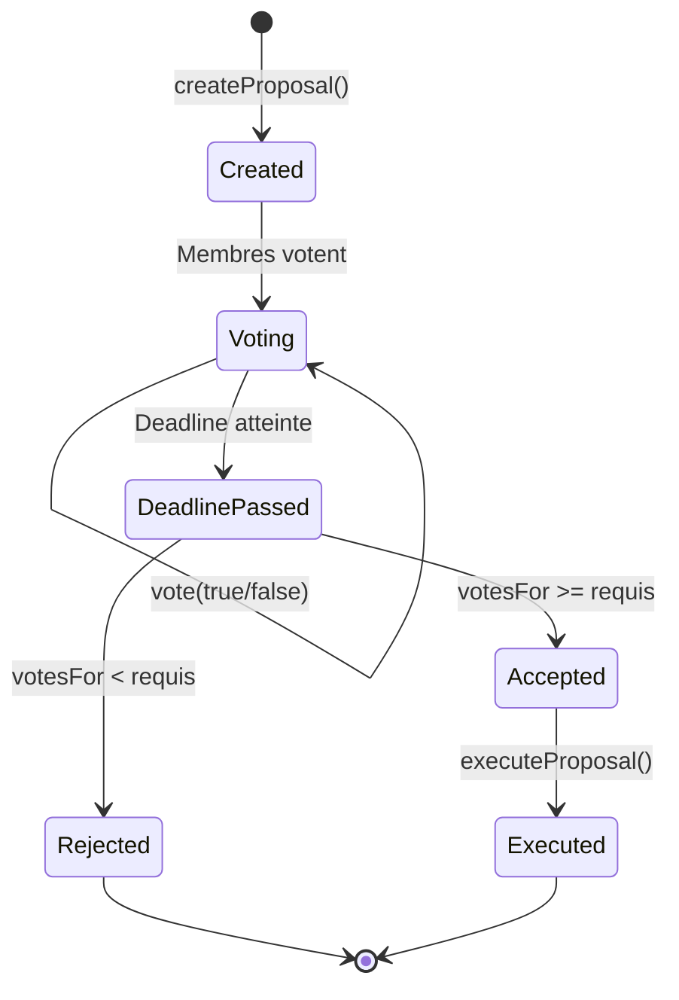
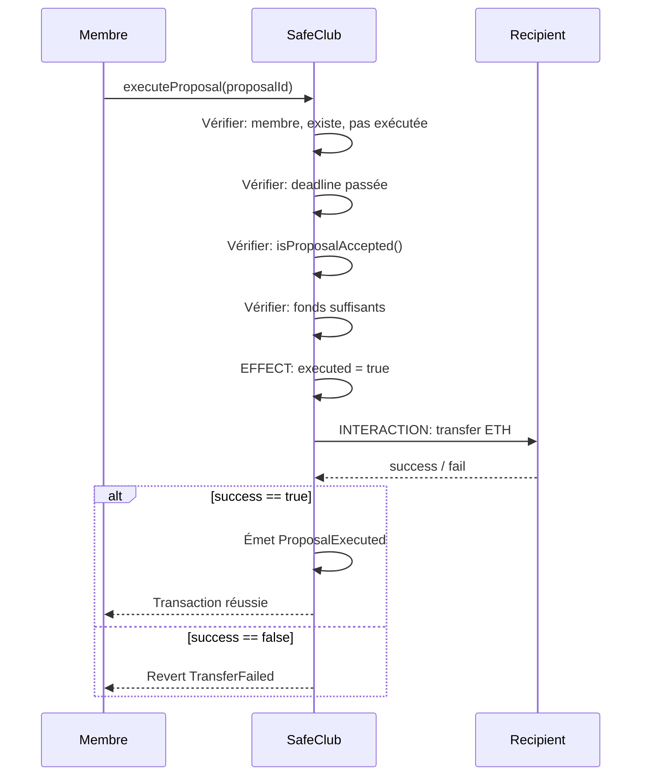
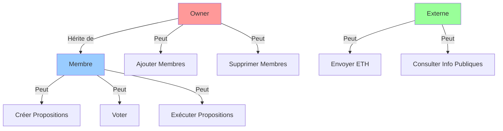

# Documentation Technique - SafeClub

**Version**: 1.0.0  
**Smart Contract**: SafeClub.sol  
**Solidity**: ^0.8.0  
**Date**: Décembre 2025

---

## Table des Matières

1. [Vue d'ensemble](#1-vue-densemble)
2. [Structures de Données](#2-structures-de-données)
3. [Fonctions Principales](#3-fonctions-principales)
4. [Règles de Décision](#4-règles-de-décision)
5. [Diagrammes](#5-diagrammes)

---

## 1. Vue d'ensemble

### 1.1 Description

SafeClub est un contrat de gestion de trésorerie décentralisée permettant à un club étudiant de:
- Stocker des ETH en toute sécurité
- Créer des propositions de dépense
- Voter démocratiquement
- Exécuter les paiements selon la règle de majorité absolue

### 1.2 Héritage

```solidity
contract SafeClub is ReentrancyGuard, Ownable
```

**Contrats hérités**:
- `ReentrancyGuard` (OpenZeppelin): Protection contre les attaques de reentrancy
- `Ownable` (OpenZeppelin): Gestion de l'ownership et contrôle d'accès administrateur

### 1.3 Imports

```solidity
import "@openzeppelin/contracts/security/ReentrancyGuard.sol";
import "@openzeppelin/contracts/access/Ownable.sol";
```

---

## 2. Structures de Données

### 2.1 Structure `Proposal`

La structure centrale pour représenter une proposition de dépense.

```solidity
struct Proposal {
    uint256 id;                 // Identifiant unique de la proposition
    string description;         // Description de la dépense
    address payable recipient;  // Adresse du destinataire des fonds
    uint256 amount;            // Montant en Wei à transférer
    uint256 deadline;          // Timestamp de fin des votes
    uint256 votesFor;          // Nombre de votes POUR
    uint256 votesAgainst;      // Nombre de votes CONTRE
    bool executed;             // True si la proposition a été exécutée
    address creator;           // Adresse du créateur de la proposition
    uint256 createdAt;         // Timestamp de création
}
```

**Champs clés**:
- `id`: Auto-incrémenté via `proposalCount++`
- `deadline`: Calculé avec `block.timestamp + (_durationInDays * 1 days)`
- `executed`: Flag critique pour empêcher la double exécution
- `votesFor / votesAgainst`: Compteurs incrémentés lors des votes

---

### 2.2 Mappings

#### members
```solidity
mapping(address => bool) public members;
```
- **Clé**: Adresse Ethereum
- **Valeur**: `true` si membre actif, `false` sinon
- **Usage**: Vérification rapide du statut de membre (O(1))

#### memberList
```solidity
address[] public memberList;
```
- **Type**: Array dynamique
- **Usage**: Énumération de tous les membres actifs
- **Note**: Mis à jour lors de l'ajout/suppression de membres

#### proposals
```solidity
mapping(uint256 => Proposal) public proposals;
```
- **Clé**: ID de la proposition (1, 2, 3, ...)
- **Valeur**: Structure `Proposal` complète
- **Usage**: Stockage et récupération des propositions

#### hasVoted
```solidity
mapping(uint256 => mapping(address => bool)) public hasVoted;
```
- **Clé 1**: ID de la proposition
- **Clé 2**: Adresse du membre
- **Valeur**: `true` si le membre a voté sur cette proposition
- **Usage**: Empêcher le double vote

#### votes
```solidity
mapping(uint256 => mapping(address => bool)) public votes;
```
- **Clé 1**: ID de la proposition
- **Clé 2**: Adresse du membre
- **Valeur**: `true` si vote POUR, `false` si vote CONTRE
- **Usage**: Tracer le choix de vote de chaque membre

---

### 2.3 Variables d'État

| Variable | Type | Visibilité | Description |
|----------|------|------------|-------------|
| `memberCount` | uint256 | public | Nombre total de membres actifs |
| `proposalCount` | uint256 | public | Compteur pour générer les IDs de propositions |

---

## 3. Fonctions Principales

### 3.1 Gestion des Membres

#### addMember()

```solidity
function addMember(address _member) external onlyOwner
```

**Paramètres**:
- `_member`: Adresse du nouveau membre à ajouter

**Contrôles**:
1. ✅ `onlyOwner`: Seul l'owner peut exécuter
2. ✅ `_member != address(0)`: Adresse valide
3. ✅ `!members[_member]`: Pas déjà membre

**Effets**:
- `members[_member] = true`
- `memberList.push(_member)`
- `memberCount++`
- Émet event `MemberAdded`

**Gas Cost**: ~50,000 gas (variable selon état du storage)

---

#### removeMember()

```solidity
function removeMember(address _member) external onlyOwner
```

**Paramètres**:
- `_member`: Adresse du membre à retirer

**Contrôles**:
1. ✅ `onlyOwner`: Seul l'owner peut exécuter
2. ✅ `members[_member]`: Doit être un membre actif

**Effets**:
- `members[_member] = false`
- `memberCount--`
- Retrait de `memberList` (swap-and-pop pattern)
- Émet event `MemberRemoved`

**Algorithme de retrait du tableau**:
```solidity
for (uint256 i = 0; i < memberList.length; i++) {
    if (memberList[i] == _member) {
        memberList[i] = memberList[memberList.length - 1]; // Swap
        memberList.pop();                                  // Pop
        break;
    }
}
```

**Gas Cost**: ~30,000-60,000 gas (dépend de la position dans le tableau)

---

#### getMembers()

```solidity
function getMembers() external view returns (address[] memory)
```

**Retour**: Tableau de toutes les adresses membres actives

**Gas Cost**: Variable (lecture seule, pas de modification d'état)

**Usage**: Interface pour afficher la liste des membres

---

### 3.2 Gestion de la Trésorerie

#### receive()

```solidity
receive() external payable
```

**Fonction spéciale**: Permet au contrat de recevoir des ETH via transfert direct

**Effets**:
- Augmente `address(this).balance`
- Émet event `FundsReceived`

**Usage**:
```solidity
// Depuis un wallet ou un autre contrat
payable(addressDuContrat).transfer(10 ether);
```

---

#### getBalance()

```solidity
function getBalance() external view returns (uint256)
```

**Retour**: Solde actuel du contrat en Wei

**Formule**: `address(this).balance`

**Conversion**: 1 ETH = 10^18 Wei

---

### 3.3 Gestion des Propositions

#### createProposal()

```solidity
function createProposal(
    string memory _description,
    address payable _recipient,
    uint256 _amount,
    uint256 _durationInDays
) external onlyMember
```

**Paramètres**:
- `_description`: Description textuelle de la dépense
- `_recipient`: Adresse qui recevra les ETH si accepté
- `_amount`: Montant en Wei
- `_durationInDays`: Nombre de jours avant la deadline

**Contrôles**:
1. ✅ `onlyMember`: Seuls les membres peuvent créer
2. ✅ `_recipient != address(0)`: Adresse valide
3. ✅ `_amount > 0`: Montant positif
4. ✅ `_amount <= address(this).balance`: Fonds disponibles
5. ✅ `_durationInDays > 0`: Durée valide

**Calcul de la deadline**:
```solidity
uint256 deadline = block.timestamp + (_durationInDays * 1 days);
```

**Effets**:
- `proposalCount++`
- Création de la structure `Proposal` dans `proposals[proposalCount]`
- Émet event `ProposalCreated`

**Gas Cost**: ~100,000-150,000 gas (stockage d'une nouvelle structure)

---

#### getProposal()

```solidity
function getProposal(uint256 _proposalId)
    external
    view
    returns (
        uint256 id,
        string memory description,
        address recipient,
        uint256 amount,
        uint256 deadline,
        uint256 votesFor,
        uint256 votesAgainst,
        bool executed,
        address creator,
        uint256 createdAt
    )
```

**Paramètres**:
- `_proposalId`: ID de la proposition à récupérer

**Retour**: Tous les champs de la structure `Proposal`

**Usage**: Interface/frontend pour afficher les détails

---

### 3.4 Système de Vote

#### vote()

```solidity
function vote(uint256 _proposalId, bool _support)
    external
    onlyMember
    proposalExists(_proposalId)
    proposalNotExecuted(_proposalId)
    beforeDeadline(_proposalId)
```

**Paramètres**:
- `_proposalId`: ID de la proposition
- `_support`: `true` pour POUR, `false` pour CONTRE

**Contrôles (5 vérifications)**:
1. ✅ `onlyMember`: Seuls les membres peuvent voter
2. ✅ `proposalExists`: La proposition doit exister
3. ✅ `proposalNotExecuted`: Pas déjà exécutée
4. ✅ `beforeDeadline`: Avant la deadline
5. ✅ `!hasVoted[_proposalId][msg.sender]`: Pas déjà voté

**Effets**:
- `hasVoted[_proposalId][msg.sender] = true`
- `votes[_proposalId][msg.sender] = _support`
- Si `_support == true`: `proposals[_proposalId].votesFor++`
- Sinon: `proposals[_proposalId].votesAgainst++`
- Émet event `VoteCast`

**Gas Cost**: ~45,000-60,000 gas

---

#### hasVotedOnProposal()

```solidity
function hasVotedOnProposal(uint256 _proposalId, address _voter)
    external
    view
    returns (bool)
```

**Retour**: `true` si le voter a déjà voté sur la proposition

---

#### isProposalAccepted()

```solidity
function isProposalAccepted(uint256 _proposalId)
    public
    view
    returns (bool)
```

**Logique**: Implémentation de la règle de majorité absolue

```solidity
uint256 requiredVotes = (memberCount / 2) + 1;
return p.votesFor >= requiredVotes;
```

**Exemples**:
- 4 membres → requis: 3 votes
- 5 membres → requis: 3 votes
- 10 membres → requis: 6 votes

**Important**: Basé sur `memberCount`, PAS sur le nombre de votants

---

### 3.5 Exécution

#### executeProposal()

```solidity
function executeProposal(uint256 _proposalId)
    external
    onlyMember
    proposalExists(_proposalId)
    proposalNotExecuted(_proposalId)
    nonReentrant
```

**Contrôles (6 vérifications)**:
1. ✅ `onlyMember`: Seuls les membres peuvent exécuter
2. ✅ `proposalExists`: Proposition existe
3. ✅ `proposalNotExecuted`: Pas déjà exécutée
4. ✅ `nonReentrant`: Protection reentrancy
5. ✅ `block.timestamp > deadline`: Deadline passée
6. ✅ `isProposalAccepted()`: Majorité absolue atteinte
7. ✅ `amount <= balance`: Fonds suffisants

**Pattern Checks-Effects-Interactions**:
```solidity
// CHECKS: Toutes les vérifications ci-dessus

// EFFECTS: Modifier l'état AVANT le transfert
p.executed = true;

// INTERACTIONS: Transfert externe
(bool success, ) = p.recipient.call{value: p.amount}("");
if (!success) revert TransferFailed();
```

**Gas Cost**: ~50,000-80,000 gas + coût du transfert

**Sécurité**: 
- ✅ Protection reentrancy (ReentrancyGuard)
- ✅ Ordre CEI (Checks-Effects-Interactions)
- ✅ Vérification du `success` du transfert

---

## 4. Règles de Décision

### 4.1 Règle d'Acceptation d'une Proposition

Une proposition est **acceptée** SI ET SEULEMENT SI:

```
votesFor > (memberCount / 2)
```

**Équivalence**: `votesFor >= ((memberCount / 2) + 1)`

### 4.2 Tableau de Référence

| Nombre de Membres | Votes POUR Requis | Pourcentage |
|-------------------|-------------------|-------------|
| 1 | 1 | 100% |
| 2 | 2 | 100% |
| 3 | 2 | 66.7% |
| 4 | 3 | 75% |
| 5 | 3 | 60% |
| 6 | 4 | 66.7% |
| 7 | 4 | 57.1% |
| 8 | 5 | 62.5% |
| 9 | 5 | 55.6% |
| 10 | 6 | 60% |

**Observation**: Le seuil est toujours **> 50%** des membres totaux

### 4.3 Cas Particuliers

#### Tous les membres votent POUR
```
4 membres, 4 votes POUR, 0 CONTRE
→ Acceptée (4 >= 3)
```

#### Majorité simple insuffisante
```
4 membres, 2 votes POUR, 0 CONTRE (2 membres n'ont pas voté)
→ Rejetée (2 < 3)
```

#### Égalité
```
4 membres, 2 votes POUR, 2 CONTRE
→ Rejetée (2 < 3)
```

#### Membre supprimé après vote
```
Initialement 5 membres → 3 votes requis
Un membre est retiré → 4 membres → toujours 3 votes requis
Proposition déjà créée garde son contexte
MAIS isProposalAccepted() utilise memberCount actuel
```

**Attention**: Si des membres sont retirés après la création d'une proposition, le seuil de votes change!

---

## 5. Diagrammes

### 5.1 Diagramme de Flux - Cycle de Vie d'une Proposition



### 5.2 Diagramme de Séquence - Exécution d'une Proposition



### 5.3 Architecture des Rôles



---

## Résumé des Fonctionnalités

### Fonctions Publiques

| Fonction | Visibilité | Modificateur | Modification d'État |
|----------|-----------|--------------|---------------------|
| `addMember()` | external | onlyOwner | ✅ Oui |
| `removeMember()` | external | onlyOwner | ✅ Oui |
| `isMember()` | external | - | ❌ View |
| `getMembers()` | external | - | ❌ View |
| `receive()` | external | payable | ✅ Oui |
| `getBalance()` | external | - | ❌ View |
| `createProposal()` | external | onlyMember | ✅ Oui |
| `getProposal()` | external | - | ❌ View |
| `vote()` | external | onlyMember | ✅ Oui |
| `hasVotedOnProposal()` | external | - | ❌ View |
| `isProposalAccepted()` | public | - | ❌ View |
| `executeProposal()` | external | onlyMember, nonReentrant | ✅ Oui |

### Gas Optimization

**Techniques utilisées**:
- ✅ Custom errors au lieu de `require()` avec strings
- ✅ Mappings pour O(1) lookups
- ✅ `uint256` (optimisé pour l'EVM)
- ✅ Packing minimal des structs
- ✅ Events pour stockage hors-chaîne

---

**Document préparé par**: Équipe SafeClub  
**Pour**: Projet Blockchain - Module ING 4  
**Institution**: TEK-UP University
